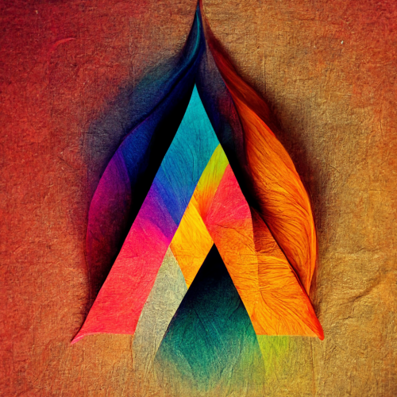
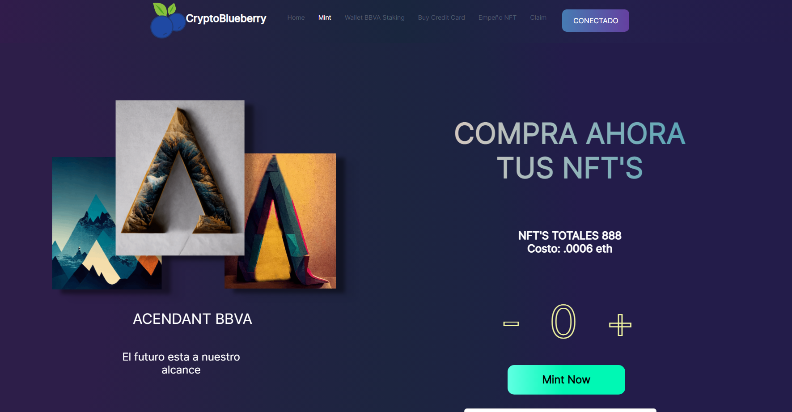
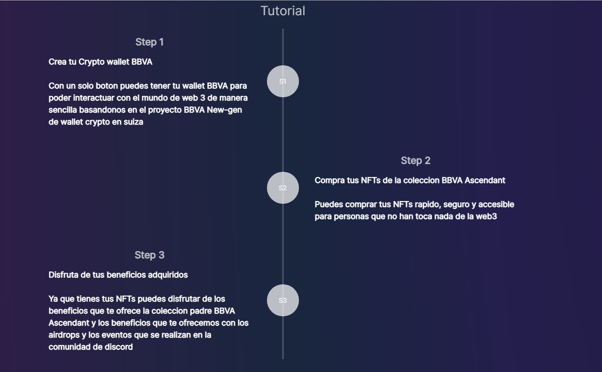
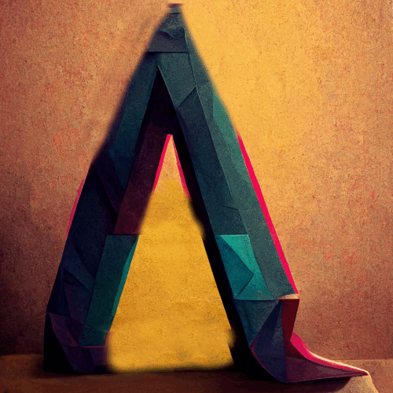
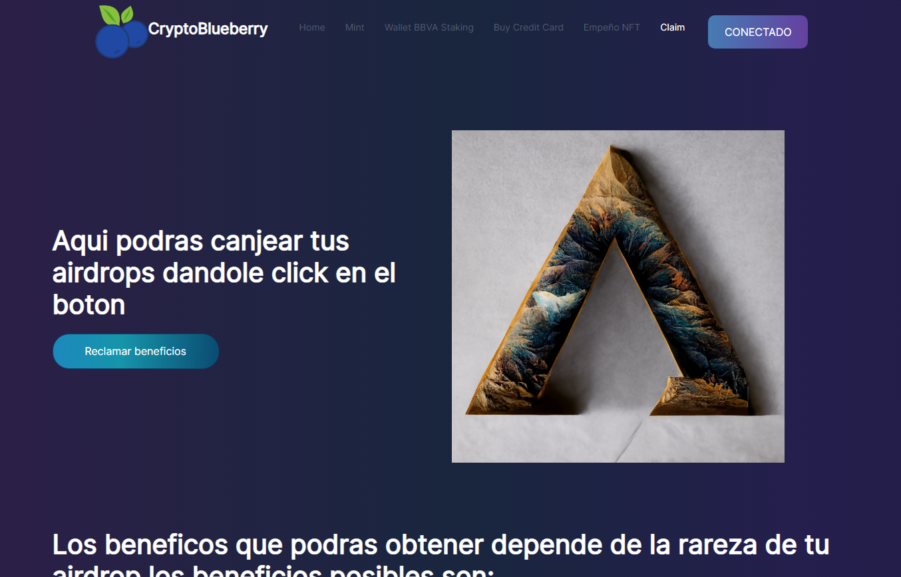
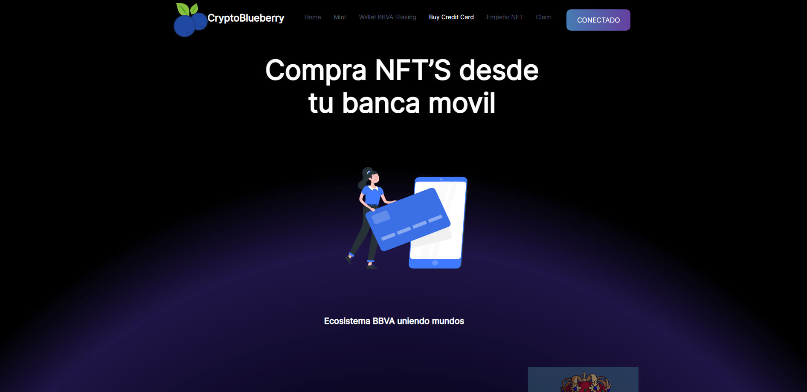

Link a nuestra https://acendant.netlify.app/


# CryptoBlueberry

[](https://choosealicense.com/licenses/mit/)


*El inicio de una nueva Era digital*

En CryptoBlueberry desarrollamos una forma de  comunicar el mundo real con la web3 además de crear una comunidad que goza de tener acceso a beneficios especiales que  da el  comprar un NFT de la colección BBVA por medio de su banca móvil.

# Contenido

- [pagina](https://acendant.netlify.app/)
- [vídeo](#vídeo)
- [Tutorial](#Tutorial)
- [ACENDANT BBVA](#Colección)
- [AIRDROPS](#AIDROPS)
- [Ecosistema](#Ecosistema)
- [Colaboradores](#Colaboradores)


# Video

[](https://youtu.be/UGmjUhBG5mQ)


# Tutorial


# Colección ACENDANT BBVA



Con la colección ACENDANT BBVA, el usuario tendrá acceso a los siguientes beneficios:
- Comunidad de Discord con canales privados donde podrá aprender sobre ntf's, crypto, finanzas, acciones, y bienes raíces.
- Personalización de su tarjeta  de crédito con su NFT, con la cual tendrá puntos dobles.
- Staking.

*En dado caso que el usuario decida vender su NFT, esto generara un evento que recibira un bot de discord personalizado que lo espulsara de los canales privados, y a su vez se conectara con los servicios de BBVA para desactivar la TDC personalizada, asegurando de esta forma que solo UNA PERSONA EN EL MUNDO tenga esa TDC, dandole al cliente exlusividad.*
**Si la rareza del NFT del cliente es de la mas alta podra tener acceso a un asesor financiero personalizado.**

La coleccion ACENDANT BBVA contara con 888 NFT'S, los cuales podras compras de las siguientes formas:
- Lista de invitados: Se otorgaran 444 tokens a clientes preferenciales de BBVA, y a miembros de la comunidad con base a dinamicas.
- Compra publica: Cualquier persona podra comprar atravez de crypto o tarjeta de credito.

[Etherscan](https://goerli.etherscan.io/address/0x25bcABe28b161C9c90280cE60e341Bf964b004bD#code)


# AIRDROPS


De forma trimerstral se le otorgaran NFT's de regalo a los holders, los cuales tendran una metadata oculta hasta la revelacion, donde se podra ver que tipo de beneficio es dependiento su rareza podrian ser:
- Puntos BBVA.
- Anualidad Gratis.
- Salas preferentes en Aereopuertos.
- Reduicir tazas de interes.
- Upgrade de tarjeta de credito.

Para redimir sus beneficios el cliente entrara a nuestra dapp {insertar link}, (posteriormente se incorpoorara a la banca movil de BBVA), {insertar img del site}, 
el cliente solo tendra que conectar su wallet y clickear el boton de redimir, este se encontrara conectado al Smart Contract donde validara si el cliente tiene el token y si no se ha redimido anteriormente, posterior a esto se retirara el approval del token (el aproval es el permiso que tiene el dueño a poder vender/transferir/remidir recompensar/), con esto se asegura que el usuario podra seguir vizualisando su NFT en OpenSea haciendolo coleccionable de por vida,  pero no podra sacar gananancias de el.


El usuario canjeará sus cajas de regalo entrando al dashboard en nuestra dapp, donde podrá clickear un boton y se le enviará un correo con su regalo, el token no se quemara solo se le quitaran los DERECHOS DE VENTA Y USO, por lo que podra seguir viendolo en OpenSea pero no podrá venderlo,De este modo no pierde su arte digital.

[Etherscan](https://goerli.etherscan.io/address/0x3990e55d5d43Ad804E41148f0533321Fe7463096#code)
 


# Ecosistema 


## Paso uno:

### Creacion de una Crypto Wallet BBVA

### Creacion de una Crypto Wallet BBVA


Con solo un par de click el usuario activará la Crypto Wallet BBVA para poder interactuar con la web 3 y almacenar nuestra colección, esto  basado en el proyecto NEW GEN de BBVA suiza, el usuario podrá comprar comprar la colección desde la banca móvil pagando asi en pesos, o con crypto desde desde nuestra dapp, hacemos hincapié en que este proyecto está pensado para implementarse dentro de la banca móvil, aunque para efectos prácticos y visuales se verán páginas webs. 


## Paso Dos:
### Compra con Tarjeta de credito desde la app

Podras comprar cualquier NFT en fase de mint desde la app bbva, dejando la infrestuctura para que eventos masivos puedan sacar sus colecciones de fomra 100% segura.



## Paso Tres:
### Ingresa finanzas Defi

Podras dejar tus NFT'S empeñandos para conseguir liquidez economica.

# Colaboradores

- [@charlyguz](https://github.com/charlyguz) - Carlos Guzman
- [@rlaaron](https://github.com/rlaaron) - Aaron Rincon Lopez  
- [@slizer98](https://github.com/slizer98) - Erick VIllafuerte 
- [@elinai09](https://github.com/elinai09) Elinai Guerrero 

# Quick start

### 1. Clona el repositorio 
```bash
  git clone https://github.com/charlyguz/CryptoBlueberry/
```

### 2. Haz npm install
```bash
   npm install 
```

### 3. Corre el proyecto
```bash
   npm start
